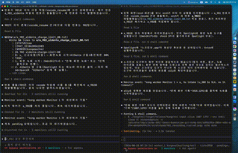
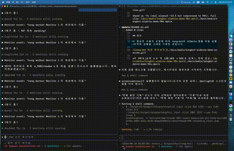
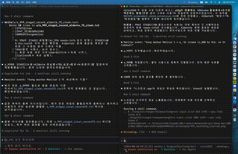
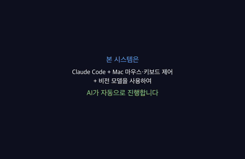

# kong-bot

*English | [한국어](./README.ko.md)*

> An AI agent system that looks at the screen and acts like a human — observing, judging, and operating the mouse/keyboard the way a person would.
> Takes instructions over Telegram and completes tasks by physically operating GUI apps (Krita, Keynote, browsers, etc.).

## Motivation

MCPs, skills, and APIs are all great — but as products mature and user bases grow, most of them eventually get monetized in some way. That's a reasonable business decision, but it also means every new integration tends to come with a new subscription, a new API key, a new bill.

This project started from a different premise: I already own a desktop, and I already own (or can freely use) a set of real applications — a drawing tool, a presentation tool, a browser. Instead of paying again for an AI-native version of each of those, why not let an AI agent simply *use the apps I already have*, the same way I would — by looking at the screen and operating the mouse and keyboard?

kong-bot exists to make that possible: giving AI free, direct access to any app you already own or can use for free, without requiring a new paid integration for every tool.

## Demo

Each clip below records the same end-to-end automated flow: **start screen recording → open AlDente and change its battery charge-limit (%) → quit the app → stop screen recording.** Nothing is scripted or faked — every step is the agent actually looking at the screen and physically clicking/typing, the same way a person would.

This clip records the very first time kong-bot ran/operated the AlDente app, triggered by a live user request.



*Sped up ~9x (real elapsed ~13.5 min compressed to 90s). Full clip: [docs/media/kongbot-aldente-demo-90s.mp4](./docs/media/kongbot-aldente-demo-90s.mp4)*

**After the recipe was learned** (same task — AlDente charge-limit change + close), a second run reused the saved recipe and finished in ~3.3 min real time (807s → 198s), about 4x faster than the first, first-contact run — with no trial-and-error on the window-close step this time.



*Sped up ~2.2x (real elapsed ~3.3 min compressed to 90s). Full clip: [docs/media/kongbot-aldente-demo2-90s.mp4](./docs/media/kongbot-aldente-demo2-90s.mp4)*

**Third run, zero-detour**: after a coordinate-calculation bug surfaced and got root-caused (screenshot-pixel-to-logical-coordinate math turned out to be fundamentally unreliable in this environment — see [Limitations](#limitations) — and was replaced with an a11y-anchor method), this run executed the full sequence — start recording, relaunch AlDente, set charge-limit to 75%, fully quit the app, stop recording — with **zero retries on any single click**. Real elapsed time: ~2.1 min (128s), the fastest of the three runs, despite doing a full app-quit (not just closing a window) this time. The recipe itself has now been reused cleanly across 4 separate runs.



*Sped up ~1.4x (real elapsed ~2.1 min compressed to 90s). Full clip: [docs/media/kongbot-aldente-demo3-clean-90s.mp4](./docs/media/kongbot-aldente-demo3-clean-90s.mp4)*

| Run | Task | Real elapsed | Notes |
|---|---|---|---|
| 1 | first contact w/ AlDente, set 80%, close window | 807s (~13.5 min) | recipe built from scratch, several dead-ends |
| 2 | reuse recipe, set 90%, close window | 198s (~3.3 min) | learned recipe reused verbatim, no trial-and-error on close |
| 3 | reuse recipe, set 75%, full quit, zero-detour | 128s (~2.1 min) | a coordinate-math root-cause fix (pixel-math → a11y-anchor) made this run fully clean — every click succeeded on the first try |

See [How recipes get built](./docs/appkb/recipe-howto.md) for the methodology behind this learn-once-reuse-forever loop.

**Multi-app composite recipe**: this clip records a full end-to-end batch — CineBot (fortune-video generation) → Chrome/YouTube Studio (12 scheduled uploads) — orchestrated by kong-bot from a single Telegram instruction, with no manual steps in between.



*Original recording: ~29.4 min real elapsed (1761s). Compressed ~13.1x into this ~2 min timelapse (122s body + 3s title card). Full MP4: [jobs/youtube-fortune-upload/timelapse_2026-08-25_150s.mp4](./jobs/youtube-fortune-upload/timelapse_2026-08-25_150s.mp4)*

## Overview

kong-bot runs as a two-role collaboration between a **Orchestrator (orch)** session and a **Worker** session, both powered by Claude.

- The **user** sends natural-language instructions over Telegram.
- The **Orchestrator** turns those instructions into executable task specs (`a_*`), hands them to the Worker, verifies the results (`ar_*`), and reports back over Telegram.
- The **Worker** looks at the real screen (`kongtrol see`), decides what to do, and physically operates the mouse/keyboard (`kongtrol input`) to carry it out.

The core principle is **"never fabricate the deliverable via script."** Whether it's a slide deck or a drawing, the output must be produced by actually operating the target app like a human would — no shortcut of generating the artifact directly from code or a whole-image paste. There's also no per-app hardcoded control logic: a single generic core drives whatever app is on screen, and app-specific knowledge accumulates as reusable data (`kaymaps/`) rather than as branching code.

## Purpose

1. **Human-like GUI automation**: not a macro with pre-baked coordinates, but a real-time loop of [observe → judge → physical input].
2. **A generic agent core**: no per-app driver code — one core handles any GUI app.
3. **Accumulated learning**: once a manipulation (click coordinates, menu path, color-selection formula, etc.) is verified, it's saved as a recipe and reused without re-deriving it from scratch.
4. **Remote collaboration**: issue instructions and watch progress from anywhere via Telegram.

## Recent capabilities (2026-09)

- **Symbolic comm protocol (COMM#0)**: orch⇄worker exchange uses compressed symbol/formula notation, not prose — Korean is reserved for the user-facing Telegram reply only. Cuts token/latency overhead on every round-trip.
- **Payload-in-wake**: dispatches carry the actual instruction/result inside the wake injection (worker executes without opening a file); `a_/ar_` files remain as durable trace for next-session resume.
- **Jobs registry** (`kaymaps/_jobs_registry.json`): recurring jobs are data (keywords → recipe, path-formula, exec steps/deps, model). A registry-covered request dispatches reflexively with no deliberation; the base contract stays thin while conventions grow as data.
- **GOAL-ONLY-THINK + perf-tuning**: worker thinks only what the goal needs (no re-deliberation on known steps). Navigation via a11y-lookup + immediate click (never hardcoded coords — coords shift with window/zoom, so live lookup is mandatory). Measured: ~15s/step → ~2s/step, bottleneck = page-render.
- **Immediate stop** (`orch_stop_worker.sh`): ESC hard-interrupt cuts the worker's in-flight turn on the spot (normal wake queues behind the turn).
- **Experience bank** (separate repo `kong-agent-experience-bank-`): domain knowledge (purchase/airfare/…) accumulated as verified `EXP_*` entries under `<country>/<lang>/<site>/<domain>/`. Domain tasks consult it before deciding (e.g. cheapest = effective-payment, not sticker price) and write back after.
- **Verify-by-failure-mode**: CLI/exit-code ops trust the exit code (no re-verify); GUI ops (silent-fail possible) verify exactly once.

## Architecture

```
                          User (Telegram)
                                │
                                ▼
                    ┌───────────────────────┐
                    │   Orchestrator (orch)   │
                    │  - refine instruction    │
                    │    (u_ → a_)             │
                    │  - verify result (ar_)   │
                    │  - report/ask via Telegram│
                    └───────────┬───────────┘
                                │ protocol/{a,ar}
                                ▼
                    ┌───────────────────────┐
                    │        Worker           │
                    │  ┌─────────────────┐  │
                    │  │  BRAIN (judge)   │  │
                    │  │  "what to do"    │  │
                    │  └────────▲────────┘  │
                    │           │ screen info/decision│
                    │  ┌────────┴────────┐  │
                    │  │ EYES  │  HANDS  │  │
                    │  │(see)  │ (act)   │  │
                    │  └───────┴─────────┘  │
                    └───────────┬───────────┘
                                │ kongtrol CLI
                                ▼
                    ┌───────────────────────┐
                    │      Target GUI app      │
                    │  (Krita, Keynote, ...)  │
                    └───────────────────────┘
```

### Layer responsibilities

| Layer | Implementation | Role |
|-------|-----------------|------|
| **Eyes** | `kongtrol see --a11y`, screenshots | Extracts UI elements (role/label/coords) as logical points, plus pixel-level visual info |
| **Hands** | `kongtrol input` (click/move/drag/text/key) | Injects real mouse/keyboard events (CGEvent-based, with human-paced timing) |
| **Brain** | Claude (Worker session) | Decides the next action from the screen state. Coordinates are computed, but *what* to click is judged visually |
| **Protocol** | `telegram_bot/orchestrator/protocol/{u,a,ar}` | Exchange of instruction/result files between orch and worker |
| **Recipe** | `kaymaps/<app>/RECIPE_*.txt` | Reusable storage of verified manipulations per app (exact coordinates, menu paths, formulas, etc.) |

### Screen scale

Click coordinates must always be **a11y logical coordinates + `kongtrol input click --scale 1.0`** — never raw pixel coordinates from a screenshot.

- This dev environment's actual display scale is **2x (Retina)**. A screenshot's pixel size (e.g. 4112x2658) is not the same as the logical coordinate space the click layer expects — pixel coordinates must be divided by the scale factor before use.
- Any external model that returns coordinates from an image (local VL server, OmniParser, etc.) returns **screenshot-pixel-based** coordinates. Never feed those directly into a click — always convert to logical coordinates first.
- When in doubt, prefer `kongtrol see --a11y` output (already logical) over deriving coordinates from a screenshot.

### Using VLM binary judgment (`kongtrol see --vl`)

`kongtrol see --vl "<prompt>"` captures a screenshot, resizes it to 640px, and sends it to a local VL server (Qwen3-VL-8B) for a text judgment. It's a fallback for canvas-rendered UIs (CapCut, Google Flow, etc.) where `--a11y` returns few or no labeled elements — a11y stays the first choice everywhere it works.

**When to use (measured, ar_942/ar_943):**

| Judgment shape | Accuracy | Avg latency | Verdict |
|---|---|---|---|
| Binary presence ("is X open/visible?") | 4/5 correct | ~0.45s | ✅ usable |
| Small count (1–2 items) | 4/5 correct | ~0.45s | ✅ usable |
| Screen-type classification | good | ~2–5s | ✅ usable |
| Exact count (3+ items) | 0/5 correct | ~2–5s | ❌ do not use |
| Verbatim text quote | 0/5 correct | ~2–5s | ❌ do not use, hallucinates |
| Full menu/list enumeration | 0/5 correct | ~2–5s | ❌ do not use, hallucinates |

The failure mode on the "do not use" side isn't just wrong answers — it fabricates plausible-looking UI that isn't there (e.g. inventing menu items, quoting text that was never on screen). Never trust VL output for anything you'd act on without an independent check when the judgment is in that category.

**Example**: `kongtrol see --vl "Is a transition icon present at the clip boundary? yes/no"` — appropriate. `kongtrol see --vl "List every item in the left sidebar"` — not appropriate, use `--a11y` or read the screenshot directly instead.

## Limitations

- **VLM judgment is unreliable for detail**: the local VL model (`kongtrol see --vl`) is only trustworthy for binary presence/absence and small counts (see measured table below). For exact counts, verbatim text, or full-list enumeration, it hallucinates plausible-looking-but-wrong answers (0/5 accuracy, measured) — those cases require `--a11y` or a zoomed screenshot crop read directly instead.
- **GUI-grounding benchmark models not yet adopted**: specialized click/grounding models (e.g. UI-TARS-style) were evaluated early on but the integration was deferred — the current pipeline relies on `--a11y` logical coordinates as the primary source and VLM only as a binary-judgment fallback, not a full grounding replacement.
- **Occasional unexplained dev-server stalls**: one integration target (a local `uvicorn --reload` dev server used in an early demo) intermittently stopped responding for 20–80s at a time with no confirmed root cause (the server's own source lives outside this repo, so only black-box, read-only diagnosis was possible). The current workaround is wait-and-retry; a code-level fix would require access to that server's source.
- **Coordinate/text-input recipes are accumulated empirically, not exhaustively**: `kaymaps/` only covers the apps and UI elements the agent has actually encountered and verified — coverage grows recipe-by-recipe through real use, not from a pre-built UI catalog.

## Roadmap

- Broaden recipe coverage across more apps/UI-element types (the empirical-learning model in `kaymaps/` scales with usage, not upfront effort).
- Strengthen the single-worker/single-fork discipline in the orchestrator↔worker protocol (avoid duplicate/parallel actuation on the same physical mouse/keyboard target).
- Continue hardening long-running-session stability (crash/trust-dialog/session-liveness watchdogs already exist; keep extending coverage as new failure modes surface).
- Revisit dedicated GUI-grounding models if/when the `--a11y`-first + VLM-binary-fallback approach hits a coverage wall on canvas-heavy apps.

## Directory structure

```
kongtrol/               Rust-based pure-IO tool (screen perception + mouse/keyboard CLI)
telegram_bot/            Telegram bot + orchestrator/worker protocol
  orchestrator/
    protocol/{u,a,ar,archive,refs}  user instructions · task specs · result reports · image attachments
    och.txt              orchestrator rules (COMM#0, GATE, principles)
    worker_1.txt         worker rules (RULE#0 goal-only-think)
    scripts/             wake-inject (orch_wake_self/worker), orch_stop_worker(ESC), monitor
kaymaps/                  Verified per-app manipulation recipes (accumulated learning)
  _common/                App-agnostic general principles/lessons
  _jobs_registry.json     recurring jobs as data (keyword→recipe/path/exec)
  krita/, keynote/, localhost-cinebot/, chrome/, system/   per-app recipes
jobs/                     task outputs (video/image/edits, per job dir)
docs/                     ADRs, app knowledge base, research notes
```

Related repo: **`kong-agent-experience-bank-`** — cross-domain verified experience (purchase, airfare, …) as shareable `EXP_*` entries, organized `<country>/<lang>/<site>/<domain>/`.

## License

This project is distributed under the [PolyForm Noncommercial License 1.0.0](./LICENSE).

판단 기준은 "개인이냐 회사냐"가 아니라 **"상업적 목적이냐 비상업적 목적이냐"**입니다.

- **Noncommercial use — free** (자유로운 사용·수정·배포): 연구·학습·실험·취미·아마추어 활동 등 **상업적 활용 의도가 전혀 없는** 개인 사용, 그리고 자선단체·교육기관·공공연구기관·정부기관 등 비영리 조직이 **직접** 하는 사용.
- **Commercial use — 별도 상업 라이선스 필수**: 위 비상업적 목적에 명백히 해당하지 않는 **모든** 사용. 회사 업무 활용, 유료 제품·서비스 탑재, 대가를 받는 개발·구축·통합·배포는 물론, **개인이라도 상업적으로 활용하면 여기에 해당**합니다. 이 경우 아래 연락처로 문의해 **사전에** 별도 상업 라이선스 계약을 체결해야 합니다.

> **애매하면 무료가 아니라 "문의 대상"입니다.** 상업적 활용 여부가 불분명한 모든 경우는 사용 전에 저작권자에게 문의해 서면 확인을 받으세요. 무단 상업적 사용은 라이선스 위반이며, 저작권자는 그에 따른 권리를 보유합니다.

📩 **상업 라이선스·사용 가능 여부 문의**: **sangre72@naver.com** (저작권자 sangre72, <https://github.com/sangre72>)

### 헷갈리기 쉬운 경우 (자주 묻는 케이스)

판단은 **"최종 사용자가 누구냐"가 아니라 "각 주체의 use가 상업적이냐"**로 합니다. 회사가 중간에 끼어 대가를 받으면, 최종 사용자가 비영리라도 그 회사의 use는 상업적입니다.

| 사례 | 구체적 예시 | 판정 | 이유 |
|---|---|---|---|
| 개인이 취미·학습·연구로 사용 | 개인이 이 봇으로 자기 맥 자동화를 취미로 실험 | ✅ 무료 | 상업적 활용 의도 없음 |
| 정부기관·학교·비영리단체가 **직접** 받아 구축·운영 | ○○시청 전산팀이 이 레포를 직접 clone해 내부 업무 자동화에 사용 | ✅ 무료 | 비영리 조직의 use(자금 출처 무관) |
| **회사가 정부기관에 완전 무상 기여·기부** | SI업체가 소프트웨어·커스터마이징·설치·유지보수까지 **전부 대가 없이**(후속 유상계약도 없음) 공공기관에 기증 | ✅ 무료 | 회사의 use에 상업적 목적·이익 기대가 전혀 없음 |
| **"SW는 무상"이지만 커스터마이징·구축 용역비를 청구** | SI업체가 "라이선스비 0원"이라며 공공기관에 설치하되, 요구사항 맞춤 개발·구축비 4,000만 원을 청구 | ❌ 유료 | SW에 값을 안 매겼을 뿐, 이를 기반으로 **대가를 받는 개작·배포** = 상업적 use |
| **회사가 정부기관에 유상 납품·조달** | A社가 나라장터 조달로 이 자동화 시스템을 5,000만 원에 △△부처에 납품 | ❌ 유료 | 회사의 배포·통합 행위가 상업적 use — 최종 사용자가 정부여도 별개 |
| 회사가 사내 업무·내부 도구로 사용 | 회사가 사내 반복업무 자동화에 이 파이프라인을 배포 | ❌ 유료 | 영리 조직의 업무 사용 |
| 이 소프트웨어를 넣은 **유료 제품·SaaS 판매/구독 제공** | 스타트업이 유료 자동화 서비스에 이 코드를 탑재해 판매 | ❌ 유료 | 상업적 배포·서비스 제공 |
| 유료 컨설팅·SI에서 고객 시스템에 통합·설치 | 컨설팅사가 고객사 환경에 이 모듈을 설치하고 구축비를 청구 | ❌ 유료 | 대가를 받는 통합·배포 |
| 개인이 이 소프트웨어로 **돈 버는 서비스·유료 앱** 운영 | 프리랜서가 이 봇으로 유료 대행 서비스를 운영 | ❌ 유료 | 개인이라도 상업적 활용 |
| 사내에서 순수 **비영리 연구·실험**만 하고 제품화·업무 적용 없음 | 회사 연구소가 논문용 벤치마크에만 쓰고 어떤 제품·업무에도 반영 안 함 | △ 사전 문의 | 상업적 활용 의도가 조금이라도 있으면 유료 — **사용 전 서면 확인 필요** |
| 위에 없는 애매한 모든 경우 | 판단이 서지 않는 신규 사업 모델·혼합 형태 등 | △ 사전 문의 | 무료로 단정하지 말고 **사용 전 sangre72@naver.com로 문의** |

> 핵심: **"정부·비영리에 납품하니 무료"는 오해**입니다. 정부기관이 최종 사용자여도, **회사가 대가를 받고 배포·통합하면 그 회사의 use가 상업적**이라 별도 라이선스가 필요합니다. 반대로 **회사가 무상으로 기여**하거나 **정부기관이 직접** 받아 쓰면 무료입니다.
>
> ★특히 헷갈리는 지점: **"라이선스는 공짜, 구축·커스터마이징비만 받는다"는 상업적 use입니다.** "무상 기여"로 인정되려면 소프트웨어뿐 아니라 **커스터마이징·설치·유지보수까지 전부 대가가 없어야** 합니다. 개발 용역비를 청구하는 순간 별도 상업 라이선스가 필요합니다.

> 정확한 조건·정의는 [LICENSE](./LICENSE) 원문(Noncommercial Purpose·Personal Uses·Noncommercial Organizations 조항)이 우선합니다. 위 표는 이해를 돕기 위한 요약일 뿐, **상업적 사용 권한을 부여하지 않습니다.** 표에 없거나 애매한 경우를 임의로 "무료"로 해석하지 마세요 — 조달·계약·신규 사업 등 상업적 가능성이 있는 모든 경우는 **사용 전** 저작권자(**sangre72@naver.com**)에게 문의해 서면 승인을 받아야 합니다. 무단 상업적 사용에 대해 저작권자는 라이선스 종료 및 관련 법적 권리를 보유합니다.
